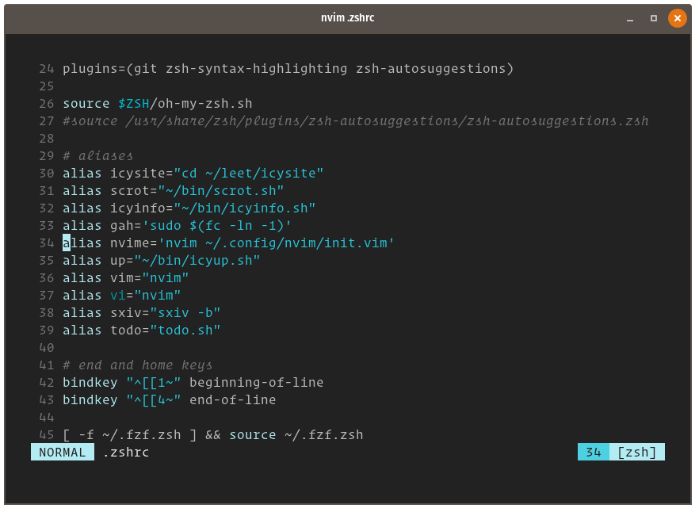

    

# Icy

Icy is a 16-bit colorscheme for nice people. But if you know how to use it with the [builder](https://github.com/chriskempson/base16), you can get away with it even if you're naughty. 

## screenshot

